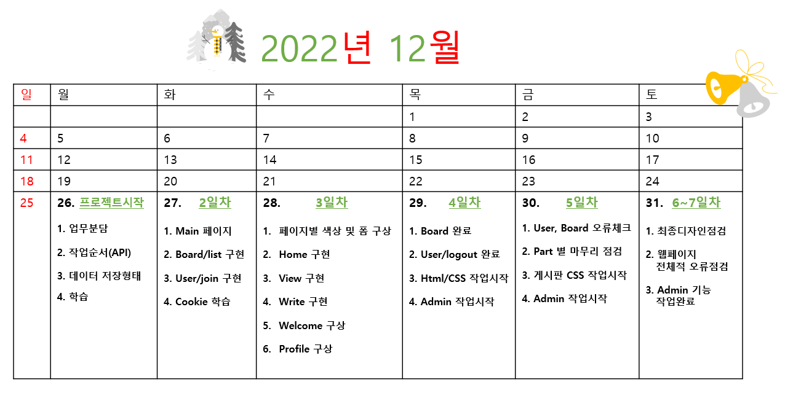

<!-- Header -->


# ⛄︎프로젝트 일정⛄︎


</br>

# 💻 Platforms & Language 🧾

<div>
    
    
    
    
    
</div>

</br>

# Tools 🛠️

<div>
    
    
</div>

</br>

# 🎨 SNS & Portfolio 🎨 
<div>
     
    
</div>


# Express Project

-   강찬수
-   김성희
-   박종환

## 1일차

### 각 파트별 구상

-   HOME
-   JOIN
-   LOGIN
-   PROFILE
-   BOARD/LIST
-   BOARD/WRITE
-   BOARD/VIEW
-   BOARD/MODIFY
-   ADMIN(선택)

### 일정 계획하기

-   날마다 한 라우터씩 구현

### 작업순서 정하기

1. 라우터 연결
2. 컨트롤러 구현
3. 데이터베이스(MYSQL) 구현
4. 레파지토리 구현
5. 서비스 구현
6. 서비스와 컨트롤러 연결
7. 화면 꾸미기(프론트)

### 각 작업별 요구사항 숙지 및 학습하기

### 데이터 저장형태 정하기(SQL)

-   데이터베이스 : project
-   테이블명: user, board

```sql
-- user
+-------------+-------------+------+-----+---------+-------+
| Field       | Type        | Null | Key | Default | Extra |
+-------------+-------------+------+-----+---------+-------+
| user_id     | varchar(50) | NO   | PRI | NULL    |       |
| user_pw     | int         | NO   |     | NULL    |       |
| user_name   | varchar(50) | NO   |     | NULL    |       |
| nickname    | varchar(50) | NO   |     | NULL    |       |
| birth       | date        | NO   |     | NULL    |       |
| gender      | char(4)     | YES  |     | 남자     |       |
| telephone   | char(32)    | YES  |     | NULL    |       |
| mobile      | char(32)    | NO   |     | NULL    |       |
| user_author | tinyint(1)  | NO   |     | 1       |       |
| level       | int         | NO   |     | 3       |       |
+-------------+-------------+------+-----+---------+-------+
```

```sql
--board
+--------------+-------------+------+-----+-------------------+-------------------+
| Field        | Type        | Null | Key | Default           | Extra             |
+--------------+-------------+------+-----+-------------------+-------------------+
| idx          | int         | NO   | PRI | NULL              | auto_increment    |
| subject      | varchar(50) | NO   |     | NULL              |                   |
| user_id      | varchar(50) | NO   |     | NULL              |                   |
| content      | text        | YES  |     | NULL              |                   |
| registerDate | datetime    | YES  |     | CURRENT_TIMESTAMP | DEFAULT_GENERATED |
| hit          | int         | YES  |     | 0                 |                   |
+--------------+-------------+------+-----+-------------------+-------------------+
```

### README 파일 입력

## 2일차

-   분배된 파트 라우터 1개(백엔드)

## 3일차

-   분배된 파트 라우터 1개(백엔드)

## 4일차

-   분배된 파트 라우터 1개(백엔드)
-   화면 꾸미기(프론트 엔드)

## 5일차

-   화면 꾸미기(프론트 엔드)


<!-- 영상 -->


</br>

<!-- Footer -->
